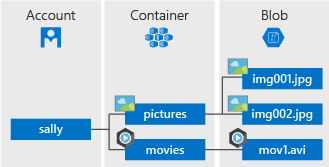
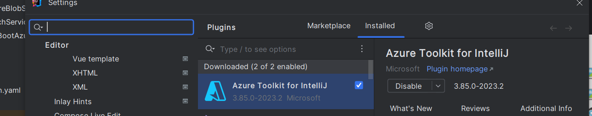
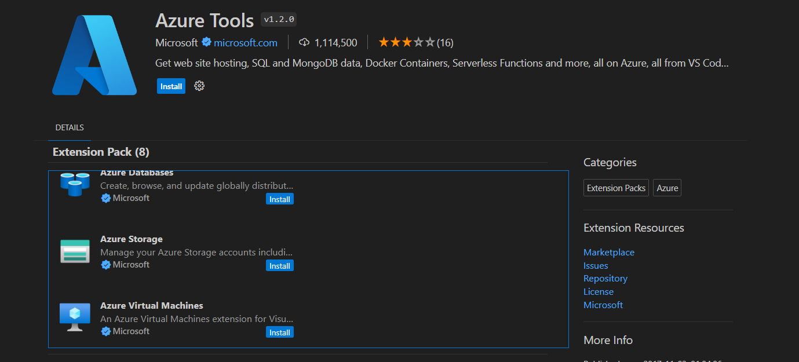

## Architecture

## Installation

Lancer la commande npm :
`npm install -g azurite`

Par la suite créer un dossier (ex : azurite) est lancer de-dans la commande : `azurite`

Une fois lancer vous pouvez utilizer le plugin azure sur Intellij ou Visual Studio pour visualiser le storage

## Well-known storage account and key
Azurite accepts the same well-known account and key used by the legacy Azure Storage Emulator.

- Account name: `devstoreaccount1`
- Account key: `Eby8vdM02xNOcqFlqUwJPLlmEtlCDXJ1OUzFT50uSRZ6IFsuFq2UVErCz4I6tq/K1SZFPTOtr/KBHBeksoGMGw==`